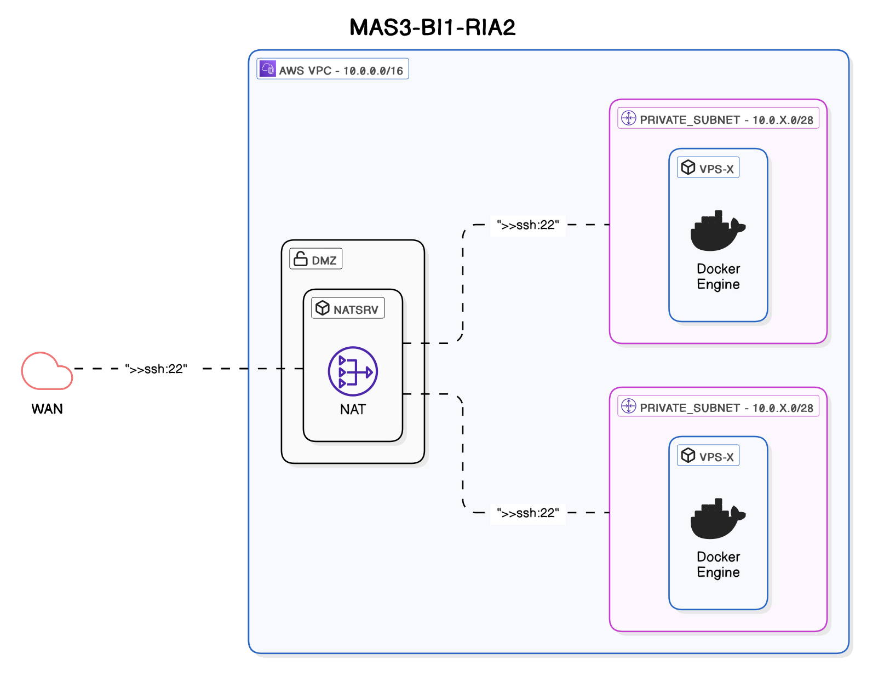

# INFRA-DEPLOY

## Infrastructure schema


# Usage
## Ansible
*As a Windows user, I'm using WSL (Debian 12) to run ansible playbook*
### Setup docker host
**Extra vars :**
- *create_user* : is the user to create on the host to be used by the devs
```bash
ansible-playbook -i '10.229.32.104,' --private-key ~/.ssh/ria2_sysadm --user root install_docker.yml -e 'create_user=elt'
```

### NatSrv
**Extra vars :**
```bash
ansible-playbook -i '10.229.32.104,' --private-key ~/.ssh/ria2_sysadm --user root natsrv.yml -e 'ssh_keys=["key1", "key2"...]'
```

# SOPS key setup (Windows)
## Encrypt vars
```PowerShell
$key = Get-Content key.txt | ForEach-Object { ($_ -split '\s+')[3] }
sops --encrypt --age $key secrets.dec.json | Out-File -Encoding ascii -FilePath secrets.enc.json
```
## Setup env. variable to use the key when running terraform
```PowerShell
$env:SOPS_AGE_KEY_FILE="$PWD\key.txt"
```

## Decrypt vars
```PowerShell
sops --decrypt secrets.enc.json | Out-File -FilePath secrets.dec.json
```

# SOPS key setup (Linux)
## Encrypt vars
```Bash
key=$(awk '{print $4}' key.txt)
sops --encrypt --age "$key" secrets.dec.json > secrets.enc.json
```
## Setup env. variable to use the key when running terraform
```Bash
export SOPS_AGE_KEY_FILE="$PWD/key.txt"
```

## Decrypt vars
```Bash
sops --decrypt secrets.enc.json > secrets.dec.json
```