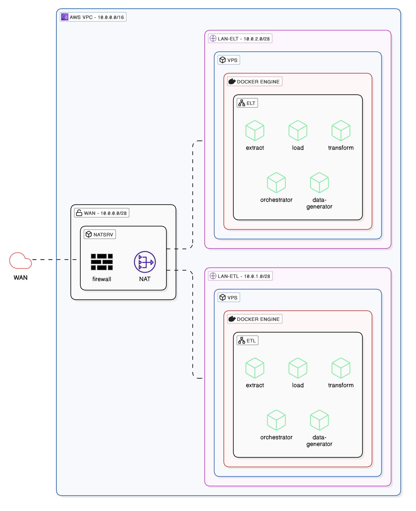

# INFRA-DEPLOY

## Infrastructure schema

# Network configuration
## Routing tables

### LAN-ETL

| DESTINATION | TARGET   |
| ----------- | -------- |
| 0.0.0.0     | 10.0.0.1 |

### LAN-ELT

|DESTINATION|TARGET|
|---|---|
|0.0.0.0|10.0.0.1|

## Security group rules (inbound - Only accepted)

| Type            | (Protocol) | (Port range) | Source         | Allow/Deny | Description |
| --------------- | ---------- | ------------ | -------------- | ---------- | ----------- |
| All ICMP - IPv4 |            |              | 193.5.240.9/32 |            | ping        |
| SSH             |            |              | 193.5.240.9/32 |            | SSH access  |

## Network ACL (VPC)

### Inbound

| Type            | (Protocol) | (Port range) | Source         | Allow/Deny | Description    |
| --------------- | ---------- | ------------ | -------------- | ---------- | -------------- |
| All ICMP - IPv4 |            |              | 193.5.240.9/32 | Allow      | ping           |
| SSH             |            |              | 193.5.240.9/32 | Allow      | SSH access     |
| HTTPS & HTTP    |            |              | 193.5.240.9/32 | Allow      | Access service |
| All traffic     | all        | all          | 0.0.0.0/0      | Deny       |                |

### Outbound

| Type        | (Protocol) | (Port range) | Source    | Allow/Deny | Description |
| ----------- | ---------- | ------------ | --------- | ---------- | ----------- |
| All traffic | all        | all          | 0.0.0.0/0 | Allow      |             |
| All traffic | all        | all          | 0.0.0.0/0 | Deny       |             |
